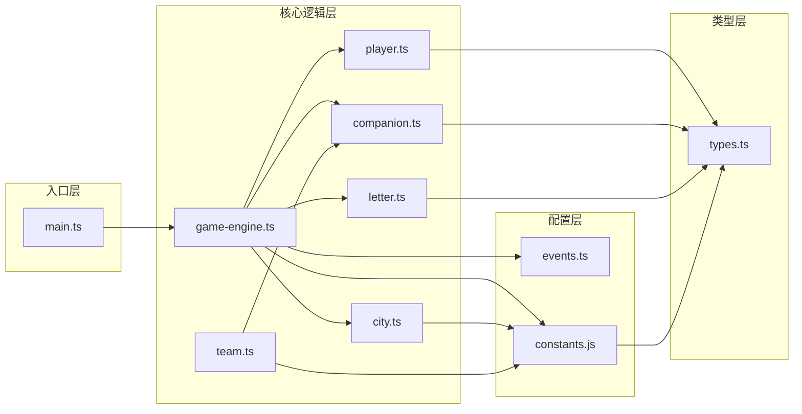

# 1. 引用关系图 (Dependency Graph)

```mermaid
graph LR
    subgraph 入口层
        MAIN[main.ts]
    end
    
    subgraph 核心逻辑层
        ENGINE[game-engine.ts]
        PLAYER[player.ts]
        COMPANION[companion.ts]
        CITY[city.ts]
        LETTER[letter.ts]
        TEAM[team.ts]
    end
    
    subgraph 配置层
        EVENTS[events.ts]
        CONSTANTS[constants.js]
    end
    
    subgraph 类型层
        TYPES[types.ts]
    end
    
    MAIN --> ENGINE
    ENGINE --> PLAYER
    ENGINE --> COMPANION
    ENGINE --> CITY
    ENGINE --> LETTER
    ENGINE --> EVENTS
    ENGINE --> CONSTANTS
    
    PLAYER --> TYPES
    COMPANION --> TYPES
    CITY --> CONSTANTS
    LETTER --> TYPES
    TEAM --> COMPANION
    TEAM --> CONSTANTS
    
    CONSTANTS --> TYPES
```

## 架构分层说明

- **入口层**: main.ts - 用户交互入口
- **核心逻辑层**: 游戏引擎与实体类
- **配置层**: 事件定义与游戏常量
- **类型层**: TypeScript类型定义
