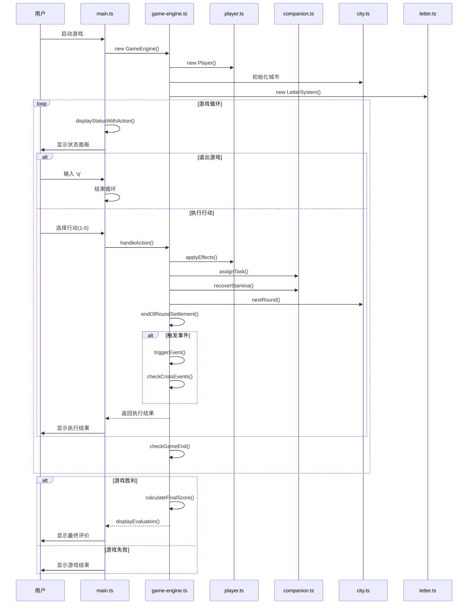

# 2. 程序运行全景图 (Global Execution Flow)

```mermaid
sequenceDiagram
    participant User as 用户
    participant Main as main.ts
    participant Engine as game-engine.ts
    participant Player as player.ts
    participant Companion as companion.ts
    participant City as city.ts
    participant Letter as letter.ts

    User->>Main: 启动游戏
    Main->>Engine: new GameEngine()
    Engine->>Player: new Player()
    Engine->>City: 初始化城市
    Engine->>Letter: new LetterSystem()
    
    loop 游戏循环
        Main->>Main: displayStatusWithAction()
        Main->>User: 显示状态面板
        
        alt 退出游戏
            User->>Main: 输入 'q'
            Main->>Main: 结束循环
        else 执行行动
            User->>Main: 选择行动(1-5)
            Main->>Engine: handleAction()
            
            Engine->>Player: applyEffects()
            Engine->>Companion: assignTask()
            Engine->>Companion: recoverStamina()
            Engine->>City: nextRound()
            Engine->>Engine: endOfRoundSettlement()
            
            alt 触发事件
                Engine->>Engine: triggerEvent()
                Engine->>Engine: checkCrisisEvents()
            end
            
            Engine-->>Main: 返回执行结果
            Main->>User: 显示执行结果
        end
        
        Engine->>Engine: checkGameEnd()
    end
    
    alt 游戏胜利
        Engine->>Engine: calculateFinalScore()
        Engine-->>Main: displayEvaluation()
        Main->>User: 显示最终评价
    else 游戏失败
        Main->>User: 显示游戏结束
    end
```
