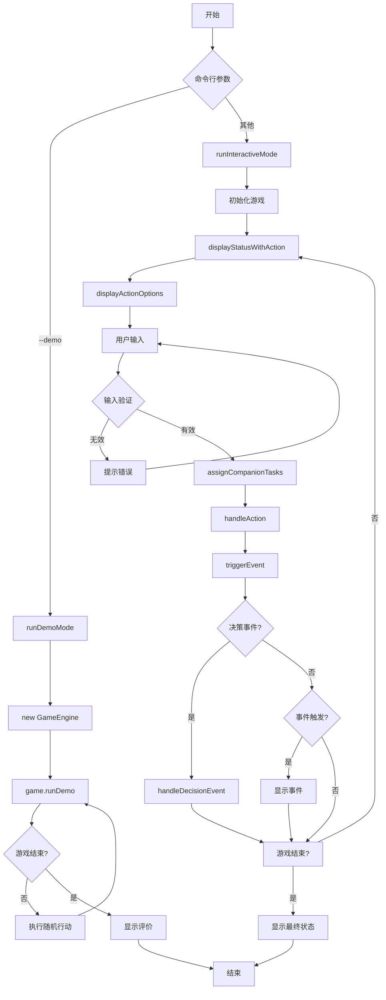

# 3. main.ts 文件流程图

```mermaid
flowchart TD
    A[开始] --> B{命令行参数}
    B -->|--demo| C[runDemoMode]
    B -->|其他| D[runInteractiveMode]
    
    C --> E[new GameEngine]
    E --> F[game.runDemo]
    F --> G{游戏结束?}
    G -->|否| H[执行随机行动]
    H --> F
    G -->|是| I[显示评价]
    
    D --> J[初始化游戏]
    J --> K[displayStatusWithAction]
    K --> L[displayActionOptions]
    L --> M[用户输入]
    
    M --> N{输入验证}
    N -->|无效| O[提示错误]
    O --> M
    N -->|有效| P[assignCompanionTasks]
    
    P --> Q[handleAction]
    Q --> R[triggerEvent]
    R --> S{决策事件?}
    S -->|是| T[handleDecisionEvent]
    S -->|否| U{事件触发?}
    U -->|是| V[显示事件]
    U -->|否| W[游戏结束?]
    
    T --> W
    V --> W
    W -->|否| K
    W -->|是| X[显示最终状态]
    
    I --> Y[结束]
    X --> Y
```

## 风险点

游戏循环中多次调用 `console.clear()` 可能导致终端闪烁；`handleAction` 后直接调用 `triggerEvent` 可能导致事件触发时机不当
