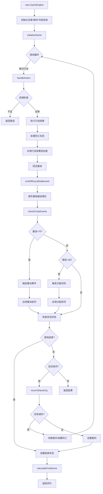

# 4. game-engine.ts 文件流程图

```mermaid
flowchart TD
    A[new GameEngine] --> B[初始化玩家/城市/书信系统]
    B --> C[initializeGame]
    
    C --> D{游戏循环}
    D -->|每次行动| E[handleAction]
    
    E --> F{资源检查}
    F -->|不足| G[返回错误]
    F -->|足够| H[执行行动效果]
    
    H --> I[处理同工任务]
    I --> J[应用行动效果到玩家]
    J --> K[回合推进]
    K --> L[endOfRoundSettlement]
    
    L --> M[城市基础逼迫增长]
    M --> N[checkCrisisEvents]
    
    N --> O{逼迫>70?}
    O -->|是| P[触发暴动事件]
    O -->|否| Q{稳定<30?}
    Q -->|是| R[触发分裂风险]
    Q -->|否| S[检查存活状态]
    
    P --> T[应用暴动惩罚]
    R --> U[应用分裂惩罚]
    T --> S
    U --> S
    
    S --> V{游戏结束?}
    V -->|是| W[设置结束状态]
    V -->|否| X{回合耗尽?}
    X -->|是| Y[moveToNextCity]
    X -->|否| Z[返回结果]
    
    Y --> AA{还有城市?}
    AA -->|是| AB[切换城市/招募同工]
    AA -->|否| AC[设置胜利]
    AB --> D
    AC --> W
    
    W --> AD[calculateFinalScore]
    AD --> AE[返回评价]
```

## 风险点

`endOfRoundSettlement` 中暴动事件每回合检查一次，高逼迫时频繁触发；`checkCrisisEvents` 缺乏冷却机制
