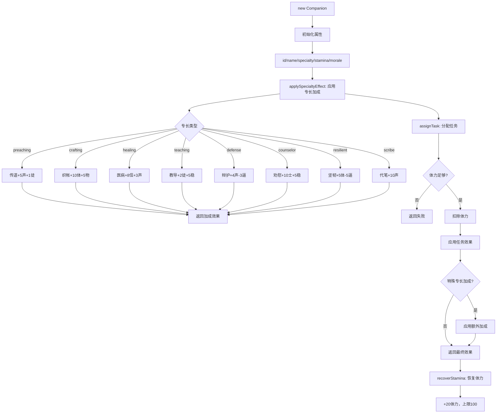

# 6. companion.ts 文件流程图

```mermaid
flowchart TD
    A[new Companion] --> B[初始化属性]
    B --> C[id/name/specialty/stamina/morale]
    
    C --> D[applySpecialtyEffect: 应用专长加成]
    
    D --> E{专长类型}
    E -->|preaching| F[传道+5声+1徒]
    E -->|crafting| G[织帐+10体+5物]
    E -->|healing| H[医病+8信+3声]
    E -->|teaching| I[教导+2徒+5稳]
    E -->|defense| J[辩护+4声-3逼]
    E -->|counselor| K[劝慰+10士+5稳]
    E -->|resilient| L[坚韧+5体-5逼]
    E -->|scribe| M[代笔+10声]
    
    F --> N[返回加成效果]
    G --> N
    H --> N
    I --> N
    J --> N
    K --> N
    L --> N
    M --> N
    
    D --> O[assignTask: 分配任务]
    O --> P{体力足够?}
    P -->|否| Q[返回失败]
    P -->|是| R[扣除体力]
    R --> S[应用任务效果]
    S --> T{特殊专长加成?}
    T -->|是| U[应用额外加成]
    T -->|否| V[返回最终效果]
    U --> V
    
    V --> W[recoverStamina: 恢复体力]
    W --> X[+20体力，上限100]
```

## 风险点

专长加成使用 `switch-case` 硬编码，新专长需修改代码；`assignTask` 未检查 `morale` 状态
