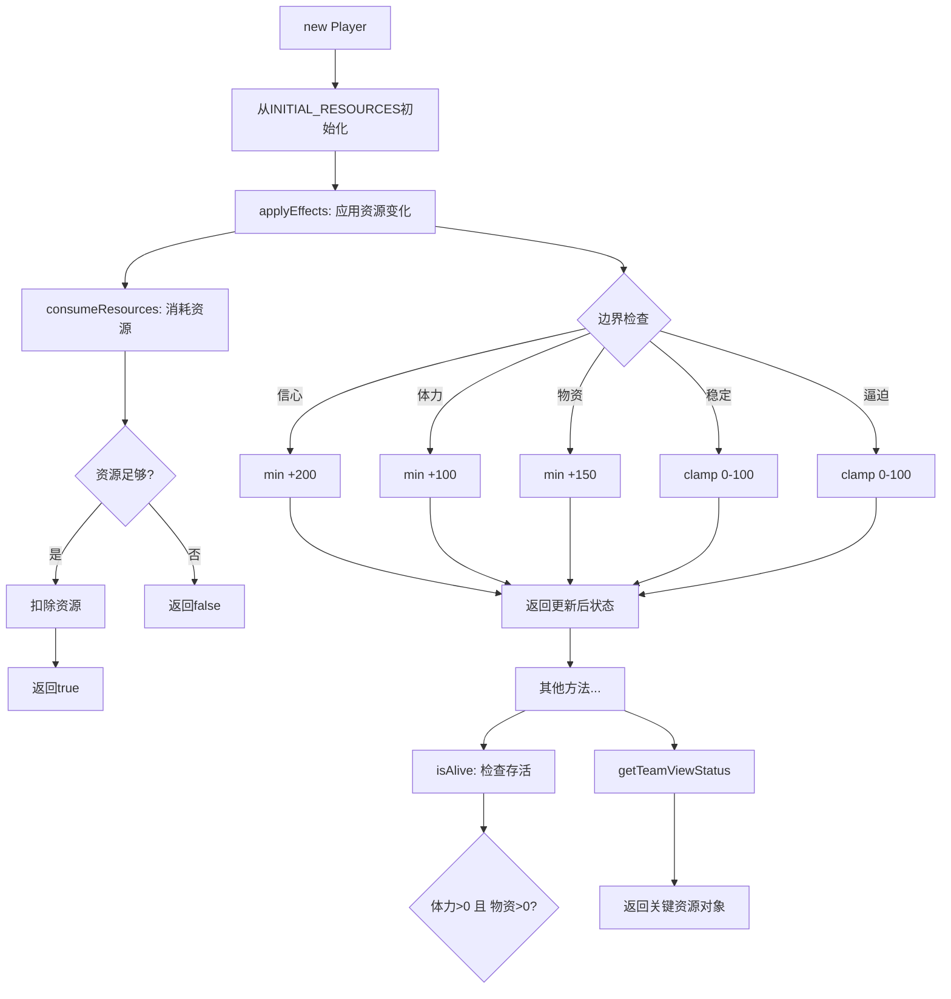

# 5. player.ts 文件流程图

```mermaid
flowchart TD
    A[new Player] --> B[从INITIAL_RESOURCES初始化]
    
    B --> C[applyEffects: 应用资源变化]
    C --> D{边界检查}
    D -->|信心| E[min +200]
    D -->|体力| F[min +100]
    D -->|物资| G[min +150]
    D -->|稳定| H[clamp 0-100]
    D -->|逼迫| I[clamp 0-100]
    
    E --> J[返回更新后状态]
    F --> J
    G --> J
    H --> J
    I --> J
    
    C --> K[consumeResources: 消耗资源]
    K --> L{资源足够?}
    L -->|否| M[返回false]
    L -->|是| N[扣除资源]
    N --> O[返回true]
    
    J --> P[其他方法...]
    
    P --> Q[isAlive: 检查存活]
    Q --> R{体力>0 且 物资>0?}
    
    P --> S[getTeamViewStatus]
    S --> T[返回关键资源对象]
```

## 风险点

`applyEffects` 中各类资源上限硬编码，扩展性差；`consumeResources` 成功后才扣减，存在原子性问题
