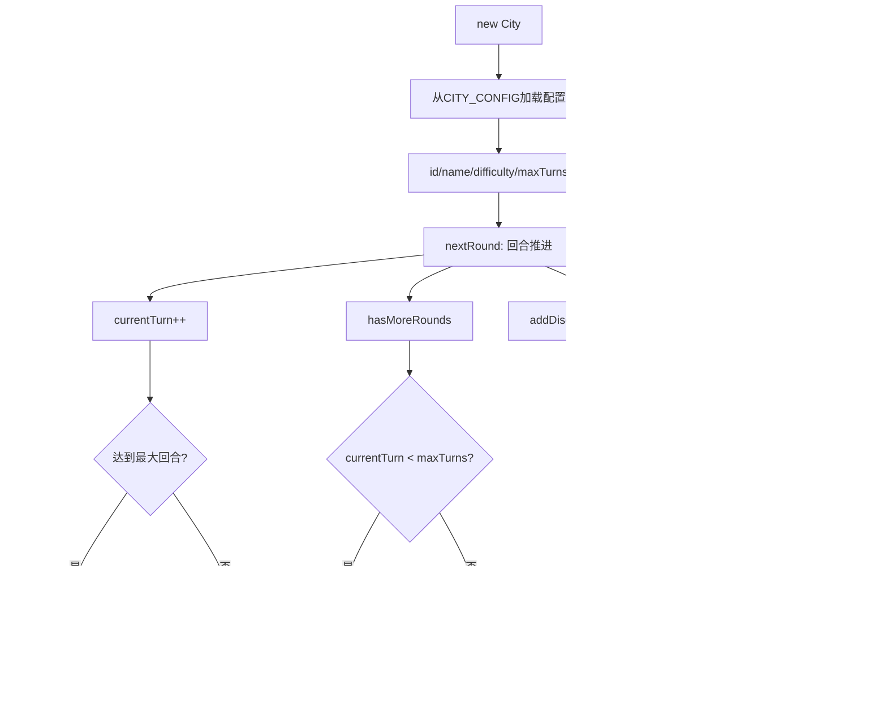

# 7. city.ts 文件流程图

```mermaid
flowchart TD
    A[new City] --> B[从CITY_CONFIG加载配置]
    B --> C[id/name/difficulty/maxTurns]
    
    C --> D[nextRound: 回合推进]
    D --> E[currentTurn++]
    E --> F{达到最大回合?}
    F -->|是| G[isCompleted = true]
    F -->|否| H[返回false]
    G --> I[返回true]
    
    D --> J[hasMoreRounds]
    J --> K{currentTurn < maxTurns?}
    K -->|是| L[返回true]
    K -->|否| M[返回false]
    
    D --> N[addDisciples: 累计门徒]
    D --> O[addReputation: 累计声望]
```

## 风险点

城市数据在构造函数后不可变，切换城市时需重新创建；`maxTurns` 固定无法动态调整
