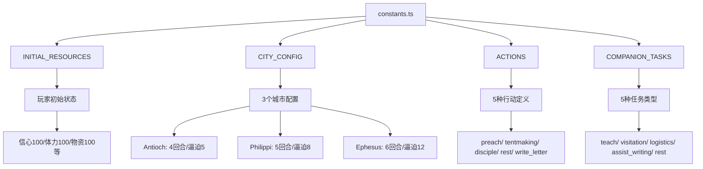

# 9. constants.ts 配置流程图

```mermaid
flowchart TD
    A[constants.ts] --> B[INITIAL_RESOURCES]
    A --> C[CITY_CONFIG]
    A --> D[ACTIONS]
    A --> E[COMPANION_TASKS]
    
    B --> F[玩家初始状态]
    F --> G[信心100/体力100/物资100等]
    
    C --> H[3个城市配置]
    H --> I[Antioch: 4回合/逼迫5]
    H --> J[Philippi: 5回合/逼迫8]
    H --> K[Ephesus: 6回合/逼迫12]
    
    D --> L[5种行动定义]
    L --> M[preach/ tentmaking/ disciple/ rest/ write_letter]
    
    E --> N[5种任务类型]
    N --> O[teach/ visitation/ logistics/ assist_writing/ rest]
```

## 风险点

所有配置硬编码，新内容需要修改源码；缺乏运行时配置加载机制
