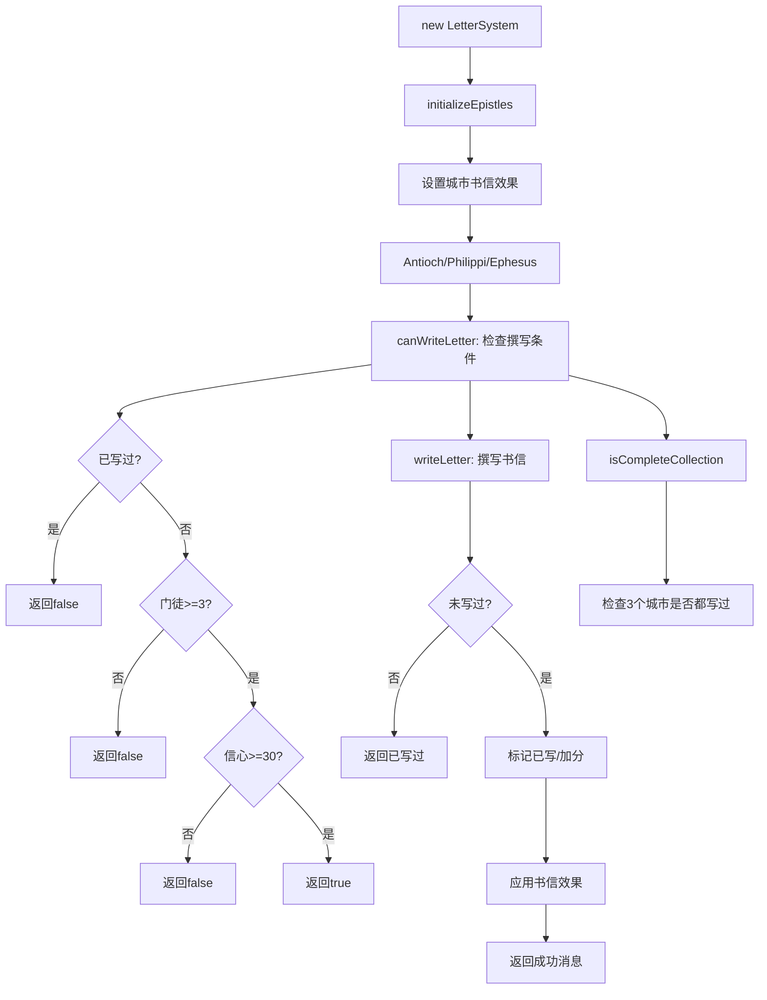

# 8. letter.ts 文件流程图

```mermaid
flowchart TD
    A[new LetterSystem] --> B[initializeEpistles]
    
    B --> C[设置城市书信效果]
    C --> D[Antioch/Philippi/Ephesus]
    
    D --> E[canWriteLetter: 检查撰写条件]
    E --> F{已写过?}
    F -->|是| G[返回false]
    F -->|否| H{门徒>=3?}
    H -->|否| I[返回false]
    H -->|是| J{信心>=30?}
    J -->|否| K[返回false]
    J -->|是| L[返回true]
    
    E --> M[writeLetter: 撰写书信]
    M --> N{未写过?}
    N -->|否| O[返回已写过]
    N -->|是| P[标记已写/加分]
    P --> Q[应用书信效果]
    Q --> R[返回成功消息]
    
    E --> S[isCompleteCollection]
    S --> T[检查3个城市是否都写过]
```

## 风险点

书信效果固定无随机性；`epistleCollection` 使用 Map 但未持久化
