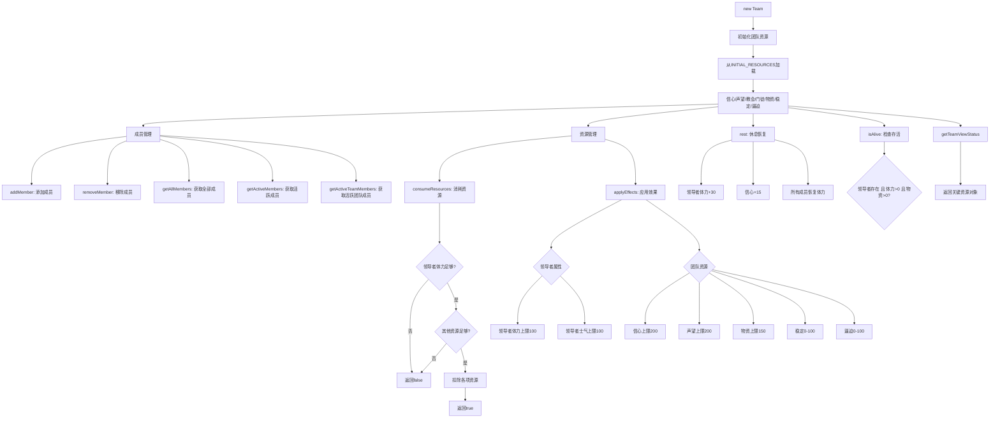

# 10. team.ts 文件流程图

```mermaid
flowchart TD
    A[new Team] --> B[初始化团队资源]
    B --> C[从INITIAL_RESOURCES加载]
    C --> D[信心/声望/教会/门徒/物资/稳定/逼迫]
    
    D --> E[成员管理]
    E --> F[addMember: 添加成员]
    E --> G[removeMember: 移除成员]
    E --> H[getAllMembers: 获取全部成员]
    E --> I[getActiveMembers: 获取活跃成员]
    E --> J[getActiveTeamMembers: 获取活跃团队成员]
    
    D --> K[资源管理]
    K --> L[consumeResources: 消耗资源]
    L --> M{领导者体力足够?}
    M -->|否| N[返回false]
    M -->|是| O{其他资源足够?}
    O -->|否| N
    O -->|是| P[扣除各项资源]
    P --> Q[返回true]
    
    K --> R[applyEffects: 应用效果]
    R --> S{领导者属性}
    S --> T[领导者体力上限100]
    S --> U[领导者士气上限100]
    
    R --> V{团队资源}
    V --> W[信心上限200]
    V --> X[声望上限200]
    V --> Y[物资上限150]
    V --> Z[稳定0-100]
    V --> AA[逼迫0-100]
    
    D --> AB[rest: 休息恢复]
    AB --> AC[领导者体力+30]
    AB --> AD[信心+15]
    AB --> AE[所有成员恢复体力]
    
    D --> AF[isAlive: 检查存活]
    AF --> AG{领导者存在 且 体力>0 且 物资>0?}
    
    D --> AH[getTeamViewStatus]
    AH --> AI[返回关键资源对象]
```

## 风险点

`Team` 类与 `Player` 类功能高度重叠，存在职责不清；资源管理逻辑分散在多个类中，难以维护一致性
